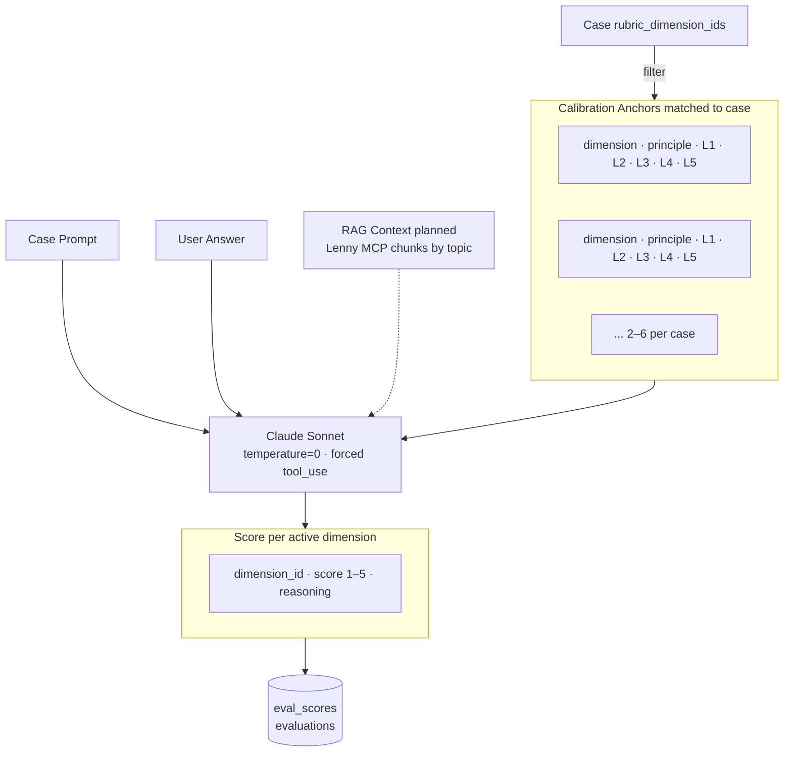
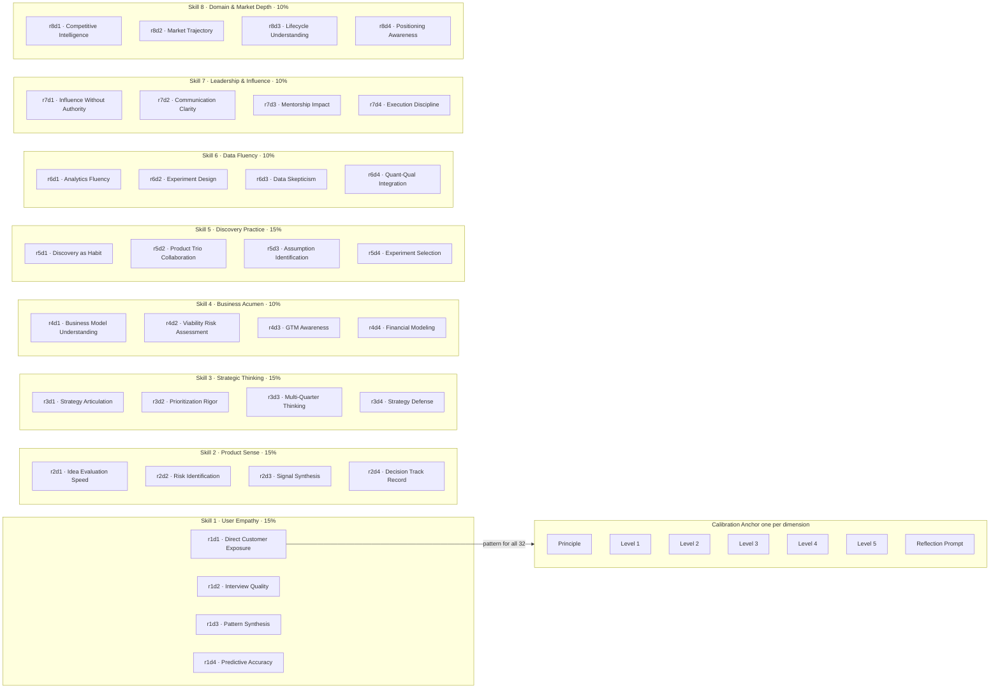
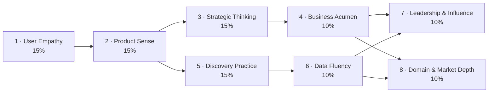

# Evaluation Architecture

## Pipeline

```mermaid
flowchart TD
    UA["User Answer"]
    CP["Case Prompt"]
    DIM["Case rubric_dimension_ids"]

    DIM -->|filter| ANC
    CP --> EVAL
    UA --> EVAL

    subgraph ANC["Calibration Anchors  matched to case"]
        A1["dimension · principle · L1 · L2 · L3 · L4 · L5"]
        A2["dimension · principle · L1 · L2 · L3 · L4 · L5"]
        AN["... 2–6 per case"]
    end

    RAG["RAG Context  planned\nLenny MCP chunks by topic"]

    ANC --> EVAL
    RAG -.-> EVAL

    EVAL["Claude Sonnet\ntemperature=0 · forced tool_use"]

    EVAL --> SCORES

    subgraph SCORES["Score per active dimension"]
        SC["dimension_id · score 1–5 · reasoning"]
    end

    SCORES --> DB[("eval_scores\nevaluations")]
```

## Rubric

```mermaid
flowchart LR
    subgraph S1["Skill 1 · User Empathy · 15%"]
        r1d1["r1d1 · Direct Customer Exposure"]
        r1d2["r1d2 · Interview Quality"]
        r1d3["r1d3 · Pattern Synthesis"]
        r1d4["r1d4 · Predictive Accuracy"]
    end

    subgraph S2["Skill 2 · Product Sense · 15%"]
        r2d1["r2d1 · Idea Evaluation Speed"]
        r2d2["r2d2 · Risk Identification"]
        r2d3["r2d3 · Signal Synthesis"]
        r2d4["r2d4 · Decision Track Record"]
    end

    subgraph S3["Skill 3 · Strategic Thinking · 15%"]
        r3d1["r3d1 · Strategy Articulation"]
        r3d2["r3d2 · Prioritization Rigor"]
        r3d3["r3d3 · Multi-Quarter Thinking"]
        r3d4["r3d4 · Strategy Defense"]
    end

    subgraph S4["Skill 4 · Business Acumen · 10%"]
        r4d1["r4d1 · Business Model Understanding"]
        r4d2["r4d2 · Viability Risk Assessment"]
        r4d3["r4d3 · GTM Awareness"]
        r4d4["r4d4 · Financial Modeling"]
    end

    subgraph S5["Skill 5 · Discovery Practice · 15%"]
        r5d1["r5d1 · Discovery as Habit"]
        r5d2["r5d2 · Product Trio Collaboration"]
        r5d3["r5d3 · Assumption Identification"]
        r5d4["r5d4 · Experiment Selection"]
    end

    subgraph S6["Skill 6 · Data Fluency · 10%"]
        r6d1["r6d1 · Analytics Fluency"]
        r6d2["r6d2 · Experiment Design"]
        r6d3["r6d3 · Data Skepticism"]
        r6d4["r6d4 · Quant-Qual Integration"]
    end

    subgraph S7["Skill 7 · Leadership & Influence · 10%"]
        r7d1["r7d1 · Influence Without Authority"]
        r7d2["r7d2 · Communication Clarity"]
        r7d3["r7d3 · Mentorship Impact"]
        r7d4["r7d4 · Execution Discipline"]
    end

    subgraph S8["Skill 8 · Domain & Market Depth · 10%"]
        r8d1["r8d1 · Competitive Intelligence"]
        r8d2["r8d2 · Market Trajectory"]
        r8d3["r8d3 · Lifecycle Understanding"]
        r8d4["r8d4 · Positioning Awareness"]
    end

    subgraph ANC["Calibration Anchor  one per dimension"]
        PR["Principle"]
        L1["Level 1"]
        L2["Level 2"]
        L3["Level 3"]
        L4["Level 4"]
        L5["Level 5"]
        RP["Reflection Prompt"]
    end

    r1d1 -->|"pattern for all 32"| ANC
```

## Skill Dependencies

```mermaid
flowchart LR
    S1["1 · User Empathy\n15%"]
    S2["2 · Product Sense\n15%"]
    S3["3 · Strategic Thinking\n15%"]
    S4["4 · Business Acumen\n10%"]
    S5["5 · Discovery Practice\n15%"]
    S6["6 · Data Fluency\n10%"]
    S7["7 · Leadership & Influence\n10%"]
    S8["8 · Domain & Market Depth\n10%"]

    S1 --> S2
    S2 --> S3
    S2 --> S5
    S3 --> S4
    S5 --> S6
    S4 --> S7
    S6 --> S7
    S4 --> S8
    S6 --> S8
```
